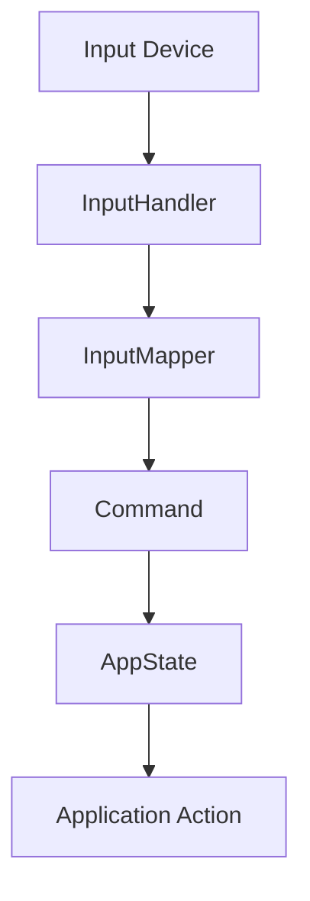

# Command-Based Input System

## Overview

The Dogputer application now uses a command-based input system that decouples physical input devices from application logic. This document explains the architecture and how to extend it for new functionality.



## Key Components

### 1. Commands

Commands are objects that represent a specific action to be performed, regardless of the input device that triggered it. All commands derive from the abstract `Command` base class and implement the `execute` method.

Location: `src/dogputer/core/commands.py`

```python
# Example: Create a command that shows a specific content
from dogputer.core.commands import ContentCommand
command = ContentCommand("ball")
app_state.handle_command(command)
```

#### Available Commands

- `ContentCommand`: Shows a specific content (image/video) by name
- `VideoChannelCommand`: Changes video channel (next/previous)
- `TogglePauseCommand`: Toggles pause state of current content
- `ExitCommand`: Exits the application

### 2. Input Handlers

Input handlers abstract different input devices (keyboard, joystick, etc.) and provide a consistent interface. Each handler can now produce commands through the input mapper system.

Location: `src/dogputer/io/input_handler.py`

```python
# Example: Get commands from an input handler
from dogputer.io.input_handler import create_input_handler
handler = create_input_handler({'input_type': 'keyboard'})
commands = handler.get_commands()
```

### 3. Input Mapper

The input mapper translates raw input events into abstract commands. It provides a mapping system that associates input events with command names.

Location: `src/dogputer/io/input_mapper.py`

```python
# Example: Create a mapper with custom mappings
from dogputer.io.input_mapper import InputMapper
import pygame

mappings = {
    pygame.K_a: "ball",
    pygame.K_ESCAPE: "exit",
    ('button', 0, 1): "treat"  # Joystick button 1 on controller 0
}
mapper = InputMapper(mappings)
```

## Using the Command System

### In the Main Loop

The main application loop now processes commands rather than raw input events:

```python
# Get and process commands from input handler
commands = input_handler.get_commands()
for command in commands:
    # Process the command
    app_state.handle_command(command)
```

### Adding New Commands

To add a new command:

1. Define the command class in `src/dogputer/core/commands.py`:

```python
class MyNewCommand(Command):
    def __init__(self, parameter):
        self.parameter = parameter
    
    def execute(self, app_state):
        # Implement the command's behavior here
        print(f"Executing with {self.parameter}")
```

2. Update the input mapper to create your new command:

```python
def _create_command_from_name(self, command_name):
    # Add handling for your command
    if command_name == "my_new_action":
        return MyNewCommand("some_parameter")
    # ...
```

3. Add mappings to trigger your command:

```python
INPUT_MAPPINGS = {
    pygame.K_m: "my_new_action",  # M key triggers your new action
    # ...
}
```

## Input Type Agnosticism

The command system achieves input type agnosticism through several layers:

1. **Abstract Input Handling**: All input handlers implement the same interface, regardless of device type.
2. **Command Abstraction**: Commands represent logical actions, not physical inputs.
3. **Mapper System**: The mapper translates device-specific events to device-agnostic commands.
4. **Composite Pattern**: Multiple input devices can be used simultaneously through the `CompositeInputHandler`.

## Testing

Unit tests for the command system are available in `tests/unit/test_command_system.py`. These tests verify that input events are correctly mapped to commands and that commands are correctly executed.

To run the tests:

```
pytest tests/unit/test_command_system.py
```

## Best Practices

1. Keep commands focused on a single responsibility.
2. Use the command system for all new input handling.
3. Prefer creating new command types over adding special cases to existing ones.
4. Always use the `handle_command` method in `AppState` rather than directly calling methods.
5. For backward compatibility, use the legacy methods only when necessary.
